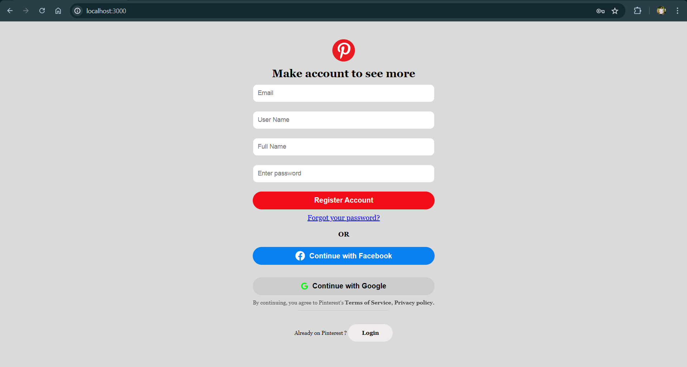
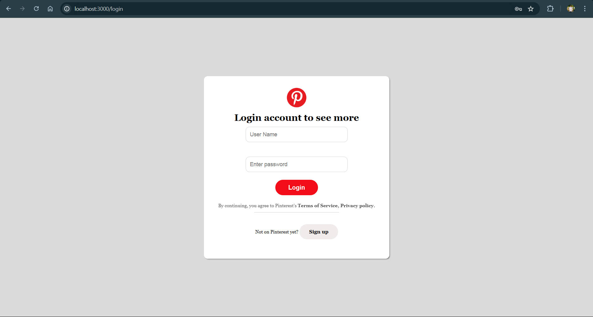
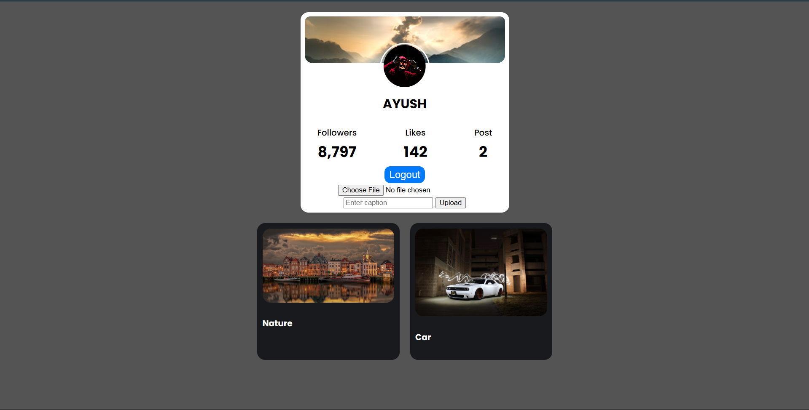

# Pinterest Clone

This project is a clone of Pinterest, created using Express.js, Node.js, MongoDB, Mongoose.js, and EJS as the view engine. The application allows users to register, log in, upload posts, and view their profile with uploaded posts.

## Features

- User registration and authentication
- User profile page with the ability to upload posts
- Display of posts in a profile page
- Logout functionality

## Technologies Used

- Node.js
- Express.js
- MongoDB
- Mongoose.js
- EJS (Embedded JavaScript templates)
- Passport.js for authentication
- Multer for file uploads
- Bootstrap for styling

## Screenshots

### Register Page

### Login Page

### Homepage

### Created By AYUSH PATEL.
